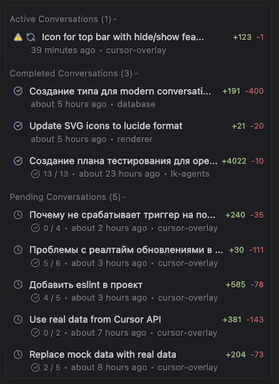

# Cursor Overlay

Transparent floating overlay that displays active Cursor AI agents in real-time. 
On top of all other windows.
It works, but it is not perfect and only tested on macOS, on my local Cursor. Contributions are welcome.



## TODO
- [ ] Solve problem with clicking on the overlay
- [ ] Hide button to right top corner of the overlay
- [ ] Fix hide/show sections by clicking 
- [ ] Fix blacklisting for session (to hide agents from view)
- [ ] Display current (in-progress) task in the overlay

## What it does

- Shows active/completed/pending Cursor agents in floating window
- Auto-updates when database changes
- Blacklist unwanted agents from view


## Quick Start

```bash
pnpm install && pnpm run dev
```

## Commands

```bash
pnpm run dev          # Dev mode with hot reload
pnpm run build        # Build TypeScript
pnpm run start        # Run production build
pnpm run lint         # Check code quality
pnpm run lint:fix     # Fix linting issues
```

## Stack

- Electron + TypeScript
- Preact (React compat)
- SQLite (reads Cursor's database)
- TailwindCSS

## Structure

```
src/
├── main.ts              # Electron main process
├── renderer/            # UI components (Preact)
├── database/            # Cursor SQLite reader
└── utils/               # Helpers
```

## Database reader

It is based on the code from [cursor-chat-history-mcp](https://github.com/vltansky/cursor-chat-history-mcp) by [vltansky](https://github.com/vltansky). Thanks for much for digging into the cursor database and making it work!